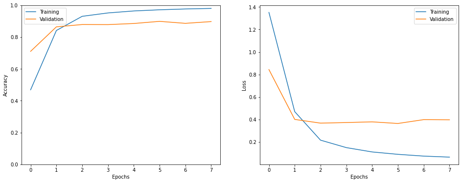
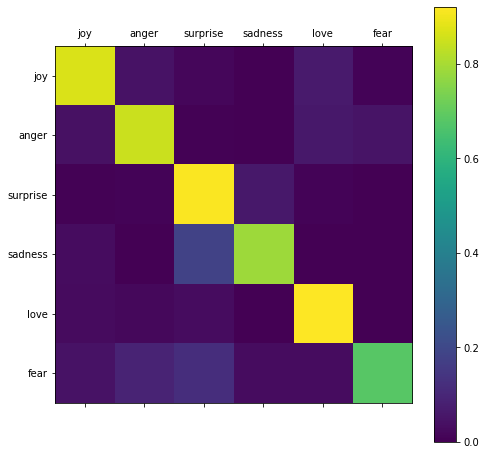

# Tweet Emotion Recognition

### In the model we used fundamental concepts of word2vec and tokenization using Tensorflow tokenizers.

### Tokenizer is a class in Tensorflow which can be used to create word embeddings.

### For the purpose of tokenizing a corpus of words is created and the words of the datasets are fit on it t create a dictionary of words.

### Which can be accessed using functions from the tokenizer class 

## In the dataset we have 5 types of sentiments to classify.
- ### anger 
- ### fear 
- ### joy 
- ### love 
- ### sadness 
- ### surprise

## The model architecture used is as follows

### Bidirectional LSTM (Long Short Term Memory) layers were used. with an embedding dimention of 16.

# We got an validation set accuracy of 89%.

## The model has the losses are given:

## The output matrix for emotions are as:
